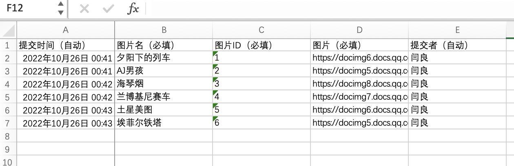

# Excel中的链接下载并重命名工具
## 介绍
在疫情背景下，学校班级工作中需要收集同学们的核酸报告等其他图片，在qq中经常使用的是工具中的收集表，然后收集表关联成文档，但是在文档导出为本地Excel文件时，确无法将图片批量下载，导出的本地Excel文件的图片那一栏只有图片对应的链接，因此需要手动下载，这样的工作量是非常大的，因此写了这个工具，可以将Excel文件中的图片链接批量下载并与Excel文件中对于行的数据进行重命名。

腾讯文档关联表格

腾讯文档关联表格导出

导出文档中有提示图片会批量下载，但是实际上好像并不会下载到本地。

导出文档确定

下载结果里并没有图片压缩包。

下载结果

本地文档

这个工具还可以用在其他类似需要的场景。
## 使用方法
### 0.环境搭建
需要安装python.
### 1.安装依赖
`pip install pandas wget openpyxl`
### 2.代码修改
代码比较简陋，需要按照用户需要进行修改
| 变量 | 说明 |
| --- | --- |
| xlsx_name | Excel文件名(默认在统一目录下，有需要的话可以添加路径) |
| imgs_dir | 图片下载目录 |
| file_name | 图片文件名统一部分 |
### 3.运行代码
`python main.py`